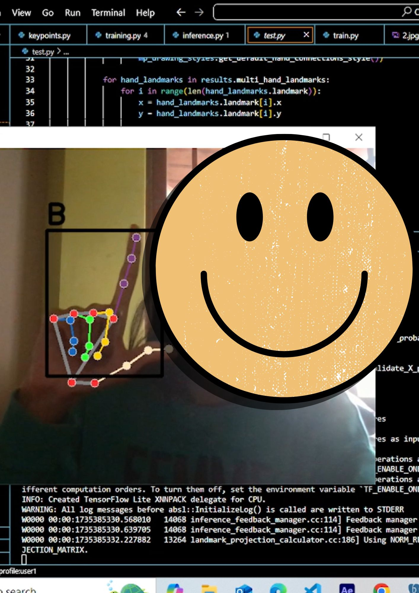
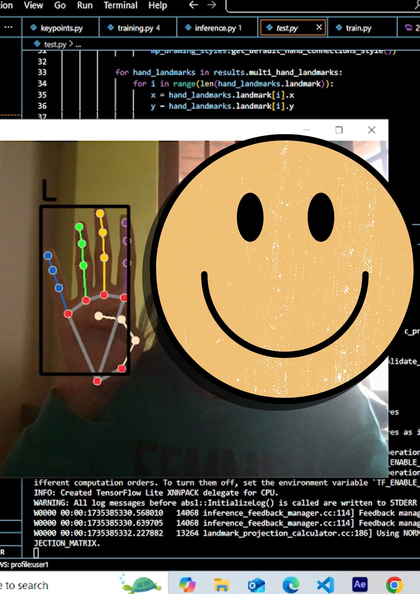
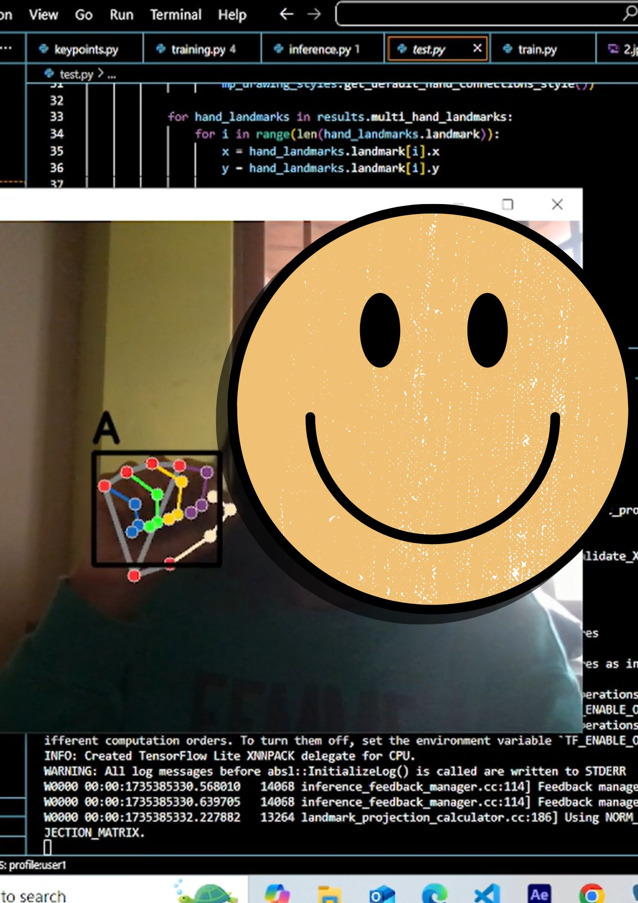

This is my first open cv project for asl translation. The translation can be done for any language. Here, i have chosen English. This entirely depends on the developer.
The project has two sections. First aspect captures hand signs for english letters. For example when someone makes the hand sign for the letter 'a' the model is able to detect this and display 'a'.
These hand movements are static. I used a random forest classifier to classify these hand signs.

The second aspect of the project detects dynamic hand gestures not static ones. for example the hand gesture for thank you and hello. For this type of detection I used LSTM but even though the accuracy is high as 0.8 there
is still a small lag in the detection. I am still attempting to fix this issue and create a more seamless experience for the users.

Bear in my this is my first open cv project and there is more that i want to add to this once i get the time to work on this project a bit more!! excited at the possibilities!!

